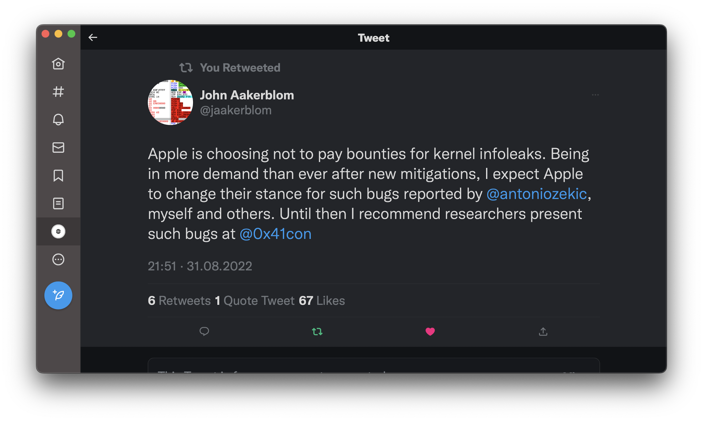

# `CodeQL + DTrace = 💧🐞 in XNU`
### How to find multiple memory disclosures in XNU using CodeQL

---
# whoami
## Arsenii Kostromin 
* Security researcher
  * Focus on macOS security: userland and kernel
* Twitter [@0x3C3E](https://twitter.com/0x3C3E)

---
# Agenda
Kernel Memory Disclosure, my 🥇 and 🥈 bugs in XNU

---
# Motivation
Apple interviewer asked me several times why I don't look for bugs in the kernel 
* `Is it hard for you?`
* Before `December 2022`, I haven't looked into the `XNU` source code

---


---
# Kernel Memory Disclosure 🥇

---
# My approach
* Search online and [tag](https://raindrop.io/quodro/mac-os-31318426) writeups
* Prepare a debugging environment
* Use CodeQL to search for some patterns 

---
# Some `easy` bugs in XNU
* [A tale of a simple Apple kernel bug](https://pwning.systems/posts/easy-apple-kernel-bug/)
   * [Weggli](https://github.com/weggli-rs/weggli) was used to find a specific pattern
* [Finding a memory exposure vulnerability with CodeQL](https://securitylab.github.com/research/apple-xnu-dtrace-CVE-2017-13782/)
  * [CodeQL](https://codeql.github.com/) was used, the author found a bug in the DTrace module of XNU
---
# How to debug kernel on a single M1 laptop?
* [QEMU](https://github.com/utmapp/UTM) emulates Intel-based macOS
* [DTrace](https://en.wikipedia.org/wiki/DTrace), dynamic tracing framework in XNU

---
# DTrace
* Released in `2005` by Oracle
* Apple merged it into XNU in `2007`
  * Was it thoroughly audited?
* It's complex and has its emulator in `the kernel`

<br>

```c
#define	DIF_OP_OR	1		/* or	r1, r2, rd */
#define	DIF_OP_XOR	2		/* xor	r1, r2, rd */
...
#define	DIF_OP_STRIP	80		/* strip r1, key, rd */
```
<!-- _footer: '[bsd/sys/dtrace.h](https://github.com/apple-oss-distributions/xnu/blob/5c2921b07a2480ab43ec66f5b9e41cb872bc554f/bsd/sys/dtrace.h#L210-L289)' -->

---
# CodeQL
* Framework for doing static analysis
* Models code as data → database
* Write logic-based SQL-like queries to find patterns

---
# Building a CodeQL database
* Have to compile the program we want to query
* By default, some files were [missing](https://github.com/github/codeql-cli-binaries/issues/145)
* A great [script](https://github.com/pwn0rz/xnu-build) to build a CodeQL database for XNU by pwn0rz

---
# Code pattern
I decided to look for OOB issues. For that, I wrote a query to find such code, which meets the conditions below:
* `a >= b`, where `a` is signed, and `b` is not
* No `a <= 0` and `a < 0` checks
* `a` is an array index

---
# `a >= b`, where `a` is signed, and `b` is not
```sql
from Variable arg
where exists(
    GEExpr ge | ge.getLeftOperand() = arg.getAnAccess()
    and ge.getLeftOperand().
      getExplicitlyConverted().
      getUnderlyingType().(IntegralType).isSigned()
    and ge.getRightOperand().
      getExplicitlyConverted().
      getUnderlyingType().(IntegralType).isUnsigned()
  )
select arg
```

---
# No `a < 0` and `a <= 0` checks
```sql
from Variable arg
where not exists(
    LTExpr le | le.getLeftOperand() = arg.getAnAccess()
    and le.getRightOperand().getValue() = "0"
  )
  and not exists(
    LEExpr le | le.getLeftOperand() = arg.getAnAccess()
    and le.getRightOperand().getValue() = "0"
  )
select arg
```
---
## `a` is an array index
```sql
from Variable arg, ArrayExpr ae
where ae.getArrayOffset() = arg.getAnAccess()
select ae.getArrayOffset(),
       ae.getEnclosingFunction()
```

---
# Combined
```sql
from Variable arg, ArrayExpr ae
where exists(
    GEExpr ge | ge.getLeftOperand() = arg.getAnAccess()
    and ge.getLeftOperand().
      getExplicitlyConverted().
      getUnderlyingType().(IntegralType).isSigned()
    and ge.getRightOperand().
      getExplicitlyConverted().
      getUnderlyingType().(IntegralType).isUnsigned()
  )
  and not exists(
    LTExpr le | le.getLeftOperand() = arg.getAnAccess()
    and le.getRightOperand().getValue() = "0"
  )
  and not exists(
    LEExpr le | le.getLeftOperand() = arg.getAnAccess()
    and le.getRightOperand().getValue() = "0"
  )
  and ae.getArrayOffset() = arg.getAnAccess()
select ae.getArrayOffset(),
       ae.getEnclosingFunction()
```
---
# The query produces
* `20` results
* Only `6` different functions

---
# `fasttrap_pid_getargdesc`
```c {3,9}
// args: (void *arg, dtrace_id_t id, void *parg, dtrace_argdesc_t *desc)
if (probe->ftp_prov->ftp_retired != 0 ||
    desc->dtargd_ndx >= probe->ftp_nargs) {
  desc->dtargd_ndx = DTRACE_ARGNONE;
  return;
}

ndx = (probe->ftp_argmap != NULL) ?
  probe->ftp_argmap[desc->dtargd_ndx] : desc->dtargd_ndx;
```
Docs: get the argument description for args[X]
<!-- _footer: '[bsd/dev/dtrace/fasttrap.c](https://github.com/apple-oss-distributions/xnu/blob/5c2921b07a2480ab43ec66f5b9e41cb872bc554f/bsd/dev/dtrace/fasttrap.c#L1367-L1374)' -->
---

### `dtargd_ndx` is `int`
```c {3}
typedef struct dtrace_argdesc {
...              
        int dtargd_ndx;                    /* arg number (-1 iff none) */
...
} dtrace_argdesc_t;
```

### `ftp_nargs` is `unsigned char`
```c {3}
struct fasttrap_probe {
...
	uint8_t ftp_nargs;                /* translated argument count */
...
};
```
<!-- _footer: '[bsd/sys/dtrace.h](https://github.com/apple-oss-distributions/xnu/blob/5c2921b07a2480ab43ec66f5b9e41cb872bc554f/bsd/sys/dtrace.h#L1331-L1337), [bsd/sys/fasttrap_impl.h](https://github.com/apple-oss-distributions/xnu/blob/5c2921b07a2480ab43ec66f5b9e41cb872bc554f/bsd/sys/fasttrap_impl.h#L119-L134)' -->

---
# Both sides are converted to `int`
As `desc->dtargd_ndx` is `int` and `probe->ftp_nargs` is `unsigned char`
```c {2}
if (probe->ftp_prov->ftp_retired != 0 ||
    desc->dtargd_ndx >= probe->ftp_nargs) {
  desc->dtargd_ndx = DTRACE_ARGNONE;
  return;
}
```
If `desc->dtargd_ndx < 0`, then `desc->dtargd_ndx >= probe->ftp_nargs` is always `false`

---
## ⚔️ OOB Read, `desc->dtargd_ndx` is an index
```c {2}
ndx = (probe->ftp_argmap != NULL) ?
  probe->ftp_argmap[desc->dtargd_ndx] : desc->dtargd_ndx;
```
If `probe->ftp_argmap` isn't `null`, it's possible to reach the first expression and use 
`desc->dtargd_ndx` with values less than `0`

---
# No direct calls to the function
It's called as a C-style `virtual function`

---
### `dtrace_pops`
```c {3-4}
typedef struct dtrace_pops {
...
        void (*dtps_getargdesc)(void *arg, dtrace_id_t id, void *parg,
            dtrace_argdesc_t *desc);
...
} dtrace_pops_t;
```
### `dtrace_pops_t`
```c {3}
static dtrace_pops_t pid_pops = {
...
	.dtps_getargdesc =	fasttrap_pid_getargdesc,
...
};
```
<!-- _footer: '[bsd/sys/dtrace.h](https://github.com/apple-oss-distributions/xnu/blob/5c2921b07a2480ab43ec66f5b9e41cb872bc554f/bsd/sys/dtrace.h#L2316-L2317), [bsd/dev/dtrace/fasttrap.c](https://github.com/apple-oss-distributions/xnu/blob/5c2921b07a2480ab43ec66f5b9e41cb872bc554f/bsd/dev/dtrace/fasttrap.c#L1440)' -->


---
### `dtps_getargdesc` might be a pointer to `fasttrap_pid_getargdesc`
```c {1,6}
prov->dtpv_pops.dtps_getargdesc(
    prov->dtpv_arg,
    probe->dtpr_id,
    probe->dtpr_arg,
    &desc
);
```
<!-- _footer: '[bsd/dev/dtrace/dtrace.c](https://github.com/apple-oss-distributions/xnu/blob/5c2921b07a2480ab43ec66f5b9e41cb872bc554f/bsd/dev/dtrace/dtrace.c#L18251-L18252)' -->


---
## Upper bound check in `fasttrap_pid_getargdesc`
```c {2}
if (probe->ftp_prov->ftp_retired != 0 ||
    desc->dtargd_ndx >= probe->ftp_nargs) {
  desc->dtargd_ndx = DTRACE_ARGNONE;
  return;
}
```

## Comparing to `-1` in `dtrace_ioctl`
```c {1}
if (desc.dtargd_ndx == DTRACE_ARGNONE)
  return (EINVAL);
```
<!-- _footer: '[bsd/dev/dtrace/fasttrap.c](https://github.com/apple-oss-distributions/xnu/blob/5c2921b07a2480ab43ec66f5b9e41cb872bc554f/bsd/dev/dtrace/fasttrap.c#L1367-L1371), [bsd/dev/dtrace/dtrace.c](https://github.com/apple-oss-distributions/xnu/blob/5c2921b07a2480ab43ec66f5b9e41cb872bc554f/bsd/dev/dtrace/dtrace.c#L18214-L18215)' -->

---
# How to leak out-of-bounds values?
```c {2,4,9}
ndx = (probe->ftp_argmap != NULL) ?
  probe->ftp_argmap[desc->dtargd_ndx] : desc->dtargd_ndx;

str = probe->ftp_ntypes;
for (i = 0; i < ndx; i++) {
  str += strlen(str) + 1;
}

(void) strlcpy(desc->dtargd_native, str, sizeof(desc->dtargd_native));
```
* We control integer index `desc->dtargd_ndx` and array of `null` delimited strings `probe->ftp_ntypes` (array of chars)
* We have to leak `probe->ftp_argmap[desc->dtargd_ndx]` (`ndx` is integer) value into `desc->dtargd_native`

---
# The idea
```c
str = probe->ftp_ntypes; // { 1, 1, 0, 1, 0, 2, 0, 3, 0, ...}
for (i = 0; i < ndx; i++) { // ndx is a value to leak
  str += strlen(str) + 1;
}
(void) strlcpy(desc->dtargd_native, str, sizeof(desc->dtargd_native));
```
* We could populate `probe->ftp_ntypes` with an array of null delimited strings
  * `[1, 1, 0, 1, 0, 2, 0, 3, 0, ..., 255]` from 0 to 255 (showed as bytes)
  * Encode `0` for example as `[1, 1, 0]`, so it's copied to the userland
* Then `ndx` equals to value in `str`
  * Special case — `0` is `"\x01\x01\x00"`

---
# `ndx = 0`
```c {2}
str = probe->ftp_ntypes;    // { 1, 1, 0, 1, 0, 2, 0, 3, 0, ...}
for (i = 0; i < ndx; i++) { //  ^
  str += strlen(str) + 1;   
}
// str points to "\x01\x01\x00" 
(void) strlcpy(desc->dtargd_native, str, sizeof(desc->dtargd_native));
```

# `ndx = 1`
```c {2}
str = probe->ftp_ntypes;    // { 1, 1, 0, 1, 0, 2, 0, 3, 0, ...}
for (i = 0; i < ndx; i++) { //           ^
  str += strlen(str) + 1;   
}
// str points to "\x01\x00" 
(void) strlcpy(desc->dtargd_native, str, sizeof(desc->dtargd_native));
```

--- 
# How to reach?
`_dtrace_ioctl` → `DTRACEIOC_PROBEARG` switch case → `fasttrap_pid_getargdesc`

---
# [CVE-2023-27941](https://support.apple.com/en-us/HT213670)

#### Kernel
`Available for: macOS Ventura`

`Impact: An app may be able to disclose kernel memory`

`Description: An out-of-bounds read issue existed that led to the disclosure of kernel memory. This was addressed with improved input validation.`

#### Details
* The bug allows reading data byte by byte in a range of 2GB
* Requires root access

---
# Patch 
Reversed `fasttrap_pid_getargdesc` changes
```c {2}
if (probe->ftp_prov->ftp_retired != 0 ||
    desc->dtargd_ndx < 0 || // added
    desc->dtargd_ndx >= probe->ftp_nargs) {
    desc->dtargd_ndx = DTRACE_ARGNONE;
    return;
}
```
* Apple hasn't released the new `XNU` source code
	* upd: [xnu-8792.81.2 and 8796.101.5 diff](https://github.com/apple-oss-distributions/xnu/compare/xnu-8792.81.2...xnu-8796.101.5?diff=unified#diff-60c1704f05c8cd2332cecee78d2f218865cdec7bc930d2401443d0b5a7913e02L1367-L1370)

---
# Kernel Memory Disclosure 🥈

---
# Code pattern
* `a < b`, where `a` is signed
* The comparison above happens in `IfStmt`
* No `a <= 0` and `a < 0` checks
* `a` is an array index

---
# `a < b`, where `a` is signed, happens in `IfStmt`
```sql
from Variable arg
where exists(
    LTExpr le |  
    le.getLeftOperand() = arg.getAnAccess()
    and le.getParent() instanceof IfStmt
    and le.getLeftOperand().
        getExplicitlyConverted().
        getUnderlyingType().(IntegralType).isSigned()
  )
select arg
```
`IfStmt` is `if (a < b) {}`, but not `a < b` in `for (a = 0; a < b; a++)`

---
# No `a < 0` and `a <= 0` checks
```sql
from Variable arg
where not exists(
    LTExpr le | le.getLeftOperand() = arg.getAnAccess()
    and le.getRightOperand().getValue() = "0"
  )
  and not exists(
    LEExpr le | le.getLeftOperand() = arg.getAnAccess()
    and le.getRightOperand().getValue() = "0"
  )
select arg
```

---
# `a` is an array index
```sql
from Variable arg, ArrayExpr ae
where ae.getArrayOffset() = arg.getAnAccess()
select ae.getArrayOffset(),
       ae.getEnclosingFunction()
```

---
# Filter results by a file path
```sql
from ArrayExpr ae
where ae.getFile().getAbsolutePath().
      matches("%/xnu-build/xnu/%")
  and not ae.getFile().getAbsolutePath().
      matches("%/xnu-build/xnu/SETUP/%")
select ae.getArrayOffset(),
       ae.getEnclosingFunction()
```

---
# Combined
```sql
from Variable arg, ArrayExpr ae
where exists(
    LTExpr le |  
    le.getLeftOperand() = arg.getAnAccess()
    and le.getParent() instanceof IfStmt
    and le.getLeftOperand().
        getExplicitlyConverted().
        getUnderlyingType().(IntegralType).isSigned()
  )
  and not exists(
    LTExpr le | le.getLeftOperand() = arg.getAnAccess()
    and le.getRightOperand().getValue() = "0"
  )
  and not exists(
    LEExpr le | le.getLeftOperand() = arg.getAnAccess()
    and le.getRightOperand().getValue() = "0"
  )
  and ae.getArrayOffset() = arg.getAnAccess()
  and ae.getFile().getAbsolutePath().matches("%/xnu-build/xnu/%")
  and not ae.getFile().getAbsolutePath().matches("%/xnu-build/xnu/SETUP/%")
select ae.getArrayOffset(),
       ae.getEnclosingFunction()
```
---
# The query produces
* `169` results
* Only `45` different functions

---
### ⚔️ OOB Read, `argno` is an index on `arm64`
```c {9}
uint64_t
fasttrap_pid_getarg(void *arg, dtrace_id_t id, void *parg, int argno,
    int aframes)
{
	arm_saved_state_t* regs = find_user_regs(current_thread());

	/* First eight arguments are in registers */
	if (argno < 8) {
		return saved_state64(regs)->x[argno];
	}
```
Docs: get the value for an argX or args[X] variable
<!-- _footer: '[bsd/dev/arm64/fasttrap_isa.c](https://github.com/apple-oss-distributions/xnu/blob/5c2921b07a2480ab43ec66f5b9e41cb872bc554f/bsd/dev/arm64/fasttrap_isa.c#L1156-L1176)' -->

---
### ⚔️ OOB Read, `argno` is an index on `x86_64`
```c {9}
uint64_t
fasttrap_pid_getarg(void* arg, dtrace_id_t id, void* parg, int argno,
    int aframes)
{
    pal_register_cache_state(current_thread(), VALID);
    return (fasttrap_anarg(
        (x86_saved_state_t*)find_user_regs(current_thread()),
        1,
        argno));
}
```
### `fasttrap_anarg`
```c {3}
// args: (x86_saved_state_t *regs, int function_entry, int argno)
if (argno < 6)
  return ((&regs64->rdi)[argno]);
```

<!-- _footer: '[bsd/dev/i386/fasttrap_isa.c](https://github.com/apple-oss-distributions/xnu/blob/5c2921b07a2480ab43ec66f5b9e41cb872bc554f/bsd/dev/i386/fasttrap_isa.c#L2207-L2214), [bsd/dev/i386/fasttrap_isa.c](https://github.com/apple-oss-distributions/xnu/blob/5c2921b07a2480ab43ec66f5b9e41cb872bc554f/bsd/dev/i386/fasttrap_isa.c#L206-L248)' -->

---
### `dtrace_pops`
```c {3-4}
typedef struct dtrace_pops {
...
        uint64_t (*dtps_getargval)(void *arg, dtrace_id_t id, void *parg,
            int argno, int aframes);
...
} dtrace_pops_t;
```
<!-- _footer: '[bsd/sys/dtrace.h](https://github.com/apple-oss-distributions/xnu/blob/5c2921b07a2480ab43ec66f5b9e41cb872bc554f/bsd/sys/dtrace.h#L2316-L2317)' -->

<!-- --- -->
### `dtrace_pops_t`
```c {3}
static dtrace_pops_t pid_pops = {
...
	.dtps_getargval =	fasttrap_pid_getarg,
...
};
```
<!-- _footer: '[bsd/dev/dtrace/fasttrap.c](https://github.com/apple-oss-distributions/xnu/blob/5c2921b07a2480ab43ec66f5b9e41cb872bc554f/bsd/dev/dtrace/fasttrap.c#L1433-L1457)' -->

---
### `dtps_getargval` might be a pointer to `fasttrap_pid_getarg`
```c {12-15}
// func: dtrace_dif_variable
// args: (dtrace_mstate_t *mstate, dtrace_state_t *state, uint64_t v, 
// uint64_t ndx)
val = pv->dtpv_pops.dtps_getargval(pv->dtpv_arg,
    mstate->dtms_probe->dtpr_id,
    mstate->dtms_probe->dtpr_arg, ndx, aframes);
```
<!-- _footer: '[bsd/dev/dtrace/dtrace.c](https://github.com/apple-oss-distributions/xnu/blob/5c2921b07a2480ab43ec66f5b9e41cb872bc554f/bsd/dev/dtrace/dtrace.c#L3308-L3310)' -->

---
# Bounds check?
```c {4}
// func: dtrace_dif_variable
// args: (dtrace_mstate_t *mstate, dtrace_state_t *state, uint64_t v, 
// uint64_t ndx)
if (ndx >= sizeof (mstate->dtms_arg) / sizeof (mstate->dtms_arg[0])) {
...
  dtrace_provider_t *pv;
  uint64_t val;

  pv = mstate->dtms_probe->dtpr_provider;
  if (pv->dtpv_pops.dtps_getargval != NULL)
    val = pv->dtpv_pops.dtps_getargval(pv->dtpv_arg,
        mstate->dtms_probe->dtpr_id,
        mstate->dtms_probe->dtpr_arg, ndx, aframes);
```
`ndx` is an `unsigned long long`, later it's converted into an `int` in `fasttrap_pid_getarg`, `argno` argument

---
# How to reach?
`dtrace_dif_emulate` → `DIF_OP_LDGA` opcode → `dtrace_dif_variable` → `fasttrap_pid_getarg`

---
# An old PoC helped to trigger the vulnerable function
Almost the same code flow as in [CVE-2017-13782](https://securitylab.github.com/research/apple-xnu-dtrace-CVE-2017-13782/) by Kevin Backhouse
* But you have to use a `fasttrap` provider, which allows tracing userland functions
  * It's possible to define a function `void foo() {}`
  * Trace it using DTrace: `pid$target::foo:entry { ... }`

---
# Code flow difference
```c {3-5,8}
pv = mstate->dtms_probe->dtpr_provider;
if (pv->dtpv_pops.dtps_getargval != NULL)
    val = pv->dtpv_pops.dtps_getargval(pv->dtpv_arg,
        mstate->dtms_probe->dtpr_id,
        mstate->dtms_probe->dtpr_arg, ndx, aframes);   // CVE-2023-28200
...
else
    val = dtrace_getarg(ndx, aframes, mstate, vstate); // CVE-2017-13782
```
* `9` lines difference
<!-- _footer: '[bsd/dev/dtrace/dtrace.c](https://github.com/apple-oss-distributions/xnu/blob/5c2921b07a2480ab43ec66f5b9e41cb872bc554f/bsd/dev/dtrace/dtrace.c#L3306-L3317)' -->

---
# [CVE-2023-28200](https://support.apple.com/en-us/HT213670)

#### Kernel
`Available for: macOS Ventura`

`Impact: An app may be able to disclose kernel memory`

`Description: A validation issue was addressed with improved input sanitization.`
#### Details
* The bug allows reading data in a range of 16GB
* Requires root access

---
# Patch
Reversed `dtrace_dif_variable` changes
```c {2}
if (ndx >= sizeof (mstate->dtms_arg) / sizeof (mstate->dtms_arg[0])) {
  if ((ndx & 0x80000000) != 0) return 0; // added
  ...
  dtrace_provider_t *pv;
  uint64_t val;

  pv = mstate->dtms_probe->dtpr_provider;
  if (pv->dtpv_pops.dtps_getargval != NULL)
    val = pv->dtpv_pops.dtps_getargval(pv->dtpv_arg,
        mstate->dtms_probe->dtpr_id,
        mstate->dtms_probe->dtpr_arg, ndx, aframes);
```
* Additional check added in caller function
* Callee functions are unfixed for some reason
* Apple hasn't released the new XNU source code
	* upd: [8792.81.2 and 8796.101.5 diff](https://github.com/apple-oss-distributions/xnu/compare/xnu-8792.81.2...xnu-8796.101.5?diff=unified#diff-8689fbf120ca6acdbe298fa3b4949bd4fee3531e9ba671460d74569b6a9dda21R3307-R3310)


---
# 😿😿😿

<!-- _footer: '[@jaakerblom](https://twitter.com/jaakerblom/status/1565049707759828992)' -->

---
# Why?
* `root` access != `kernel` access on macOS
* `SIP` puts the whole system into a sandbox
  * even `root` can't load untrusted kernel extensions
* \+ I had `App Sandbox Escape` → `user to root` LPE chain

---
# PoCs
* [CVE-2023-27941](https://github.com/0x3c3e/pocs/tree/main/CVE-2023-27941) matches kernel addresses from leaked data
* [CVE-2023-28200](https://github.com/0x3c3e/pocs/tree/main/CVE-2023-28200) only panics the kernel

--- 
# Conclusion
* Apple has to maintain two architectures: `x86_64` and `arm64`
* C-like `virtual functions` make `static` analysis harder

---
# Resources
* [Real hackers don't leave DTrace](https://www.synacktiv.com/sites/default/files/2022-05/real_hackers_don-t_leave_dtrace.pdf)
* [Finding a memory exposure vulnerability with CodeQL](https://securitylab.github.com/research/apple-xnu-dtrace-CVE-2017-13782/)
* [There is no S in macOS SIP](https://s.itho.me/ccms_slides/2022/9/29/367d1246-198f-40c5-95bf-2916bcb33f14.pdf)

---
<!--
_paginate: false
-->
# Thank you
